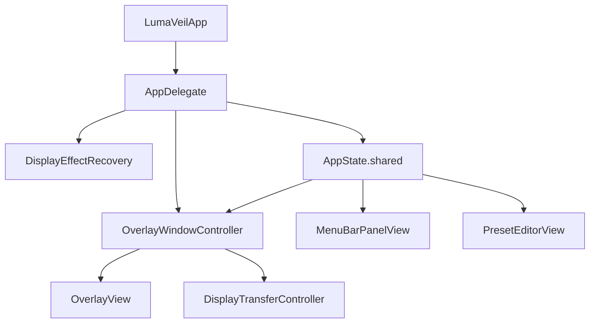

# Architecture

## Objetivo

Este documento describe la arquitectura técnica de `LumaVeil` tal y como está implementada en el repositorio actual. Está orientado a desarrolladores que necesiten entender el flujo principal, las decisiones de diseño y los límites conocidos del sistema.

## Capas funcionales

### 1. Arranque y ciclo de vida

- `LumaVeilApp.swift`
- `AppDelegate`

Responsabilidades:

- arrancar la app de menubar
- montar `NSStatusItem` + `NSPopover`
- puentear SwiftUI con AppKit
- recuperar el display si hubo un cierre sucio previo
- restaurar el estado del sistema al terminar

### 2. Estado

- `AppState.swift`

Responsabilidades:

- mantener presets, selección activa, bypass y parámetros en vivo
- publicar cambios con `ObservableObject` + `@Published`
- concentrar las reglas de edición y persistencia

### 3. Persistencia

- `Persistence/PresetStore.swift`
- `Models/FactoryPresets.swift`

Responsabilidades:

- leer y escribir `presets.json`
- guardar sesión ligera en `UserDefaults`
- mantener el preset bloqueado `Neutro`
- exponer el flag de crash recovery `lumaveil.effectActive`

### 4. Interfaz

- `UI/MenuBarPanel/*`
- `UI/PresetEditor/*`

Responsabilidades:

- panel de menubar
- editor de presets
- selección y edición de parámetros

### 5. Efecto visual

- `Overlay/OverlayWindowController.swift`
- `Overlay/OverlayView.swift`
- `DisplayTransferController.swift`

Responsabilidades:

- dibujar el overlay transparente
- aplicar gamma ramps al display principal
- coordinar ambos mecanismos en cada cambio de estado

## Flujo principal

Flujo operativo resumido:

1. `LumaVeilApp` delega el ciclo de vida en `AppDelegate`, que crea la infraestructura de `NSStatusItem` y `NSPopover`.
2. `AppDelegate` ejecuta `DisplayEffectRecovery.recoverIfNeeded()` antes de crear la infraestructura visual.
3. `AppState.shared` carga presets y sesión persistida.
4. `OverlayWindowController` observa `liveParameters` e `isBypassed`.
5. Cada cambio actualiza `OverlayView` y `DisplayTransferController`.

## Narrativa dual de color

### Intento original

La arquitectura inicial intentó resolver todos los ajustes mediante `CIFilter` aplicado como `backgroundFilters` sobre un `CALayer` transparente dentro de una ventana overlay.

### Problema observado

En macOS con Apple Silicon, ese enfoque no producía el efecto esperado sobre el escritorio completo. El filtro solo procesaba los píxeles de la propia ventana overlay, no la composición final de otras ventanas y apps.

### Solución adoptada

El pipeline se separó en dos mecanismos según la naturaleza del efecto:

- **Overlay aditivo**
  Aplica `dimming` y color superpuesto pintando encima del escritorio mediante una `NSWindow` transparente.
- **Gamma ramp multiplicativa**
  Aplica `brightness`, `contrast`, `gamma` y `temperature` con `CGSetDisplayTransferByTable`, modificando la traducción RGB del display principal.

### Trade-offs

- `saturation` no entra en v1.
- La razón es técnica: una saturación correcta requiere mezcla entre canales, mientras que la gamma ramp disponible aquí trabaja con curvas por canal.
- El sistema opera sobre el display principal, no sobre una arquitectura multi-display independiente.

## Divergencia entre `Package.swift` y Xcode

La divergencia es intencionada.

### Por qué existe

Durante el desarrollo hubo fases en las que el entorno del agente de código solo disponía de Command Line Tools y no de una instalación completa de Xcode. `Package.swift` se añadió para poder compilar y testear la lógica de dominio y persistencia en ese contexto.

### Qué cubre cada uno

`LumaVeil.xcodeproj`:

- app completa
- UI
- overlay
- recursos
- `Info.plist`

`Package.swift`:

- `AppState`
- `DisplayTransferController`
- modelos
- persistencia
- tests unitarios

### Qué implica

- `swift test` valida la parte lógica y testeable del sistema
- no valida UI, rendering, menubar ni ventanas AppKit
- la app real sigue siendo el proyecto Xcode

## `AppState` como concentrador

`AppState` centraliza:

- estado observable
- reglas de selección
- acciones de edición
- persistencia de sesión
- persistencia de la biblioteca de presets

Esto es deuda técnica conocida y aceptada. La razón para mantenerlo así en v1 es pragmática: el código funciona, la app es pequeña y separar responsabilidades ahora implicaría un refactor más invasivo que el beneficio inmediato que aportaría.

## Crash recovery

El mecanismo de recuperación usa `UserDefaults` con la clave:

- `lumaveil.effectActive`

Funcionamiento:

1. Cuando `DisplayTransferController` aplica una tabla de transferencia custom, marca el flag como activo.
2. Cuando restaura el baseline o el bypass deja el efecto inactivo, limpia el flag.
3. En el siguiente arranque, `AppDelegate` llama a `DisplayEffectRecovery.recoverIfNeeded()`.
4. Si el flag seguía activo, la app asume un cierre sucio, llama a `CGDisplayRestoreColorSyncSettings()` y limpia el flag antes de continuar.

Esto cubre el caso en que la app termine sin pasar por su ruta normal de restauración.

## Logging

El proyecto usa `Logger` de Apple con subsystem:

- `com.diegofernandezmunoz.LumaVeil`

Categorías observadas:

- `lifecycle`
- `display`
- `persistence`
- `overlay`

El logging se usa en puntos críticos:

- arranque y terminación
- instalación e invalidación de handlers de señal
- aplicación y restauración de tablas de transferencia
- recuperación tras cierre sucio
- lectura y escritura de persistencia
- visibilidad y resincronización del overlay

## Tests

La suite actual ejecuta 21 tests mediante el framework `Testing` de Apple.

### Cobertura actual

- invariantes de `DisplayTransferTableBuilder`
- aplicación y restauración de gamma ramps
- cambio de display principal
- seguimiento del flag `effectActive`
- recuperación tras cierre sucio
- carga, reparación y guardado de presets
- compatibilidad con datos legacy
- reglas de selección, edición y orden de presets

### Lo que no cubre

- `NSStatusItem` / `NSPopover`
- ventanas AppKit
- rendering del overlay
- comportamiento visual real sobre un display físico
- smoke test de arranque del target app

La ausencia de tests de UI no es accidental: `Package.swift` solo incluye la capa lógica para poder correr `swift test` sin depender de Xcode completo.
